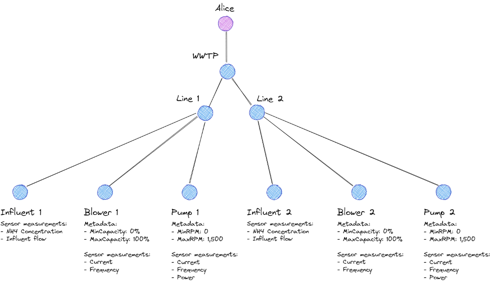

# twinn-ml-example
Documentation and code for onboarding a timeseries machine learning model to the `twinn-ml-platform`.

## Data models
The data is represented by a __rooted tree__ that mimics the real world (usually physical) relationships inherent in the data. This is easiest to understand with an example:



In this example, a tenant named Alice manages a wastewater treatment plant (WWTP) with two lines with various components and equipment, such as aeration blowers and pumps. For the rest of this document, we will name the nodes of the tree `units` and their respective measurements or other timeseries data `tags`.

This tree is not just represented in the figure, but also in the code used by the darrow platform. That is, there are specific `UNIT` objects, `TAG` objects and others that are used to define a rooted tree consisting of one parent node (tenant), with one or more children nodes (in this case WWTP), with one or more children nodes (in this case lines) etc.

When creating your own `ModelInterfaceV4` compliant model for onboarding onto the platform, keeping this structure in mind is very useful. Below we will go into more depth about how the `ModelInterfaceV4` relates to this rooted tree.

## `ModelInterfaceV4`: A contract to ensure succesful onboarding
The `ModelInterfaceV4` is a python _Protocol_. That means, it specifies exactly what methods need to be defined, which parameters need to be inputted and what needs to be returned by a class in order to be a Protocol of type `ModelInterfaceV4`. Unlike a _Base class_, it does not allow for inheritance. Because of this it also does not allow an `__init__()` method. Instead, it is more a recipe to follow.

## How `ModelInterfaceV4` relates to the __rooted tree__
When adapting your models to `ModelInterfaceV4` you will come across a lot of custom classes and Enums that in some way relate to the __rooted tree__ data model. Let us have a closer look at each of them:

```python
class StahModel(ModelInterfaceV4):

    model_type_name: str = "afvoervoorspellingen_stah"
    # Model category is based on the output of the model.
    model_category: ModelCategory = ModelCategory.prediction
    # Number between (-inf, inf) indicating the model performance.
    performance_value: float
    # List of features used to train the model. If not supplied, equal to data_config().
    train_data_config: dict[DataLevels, list] | None = None
    # This is only needed when get_target_tag_template returns UnitTagTemplate
    target: UnitTag | None = None
```


